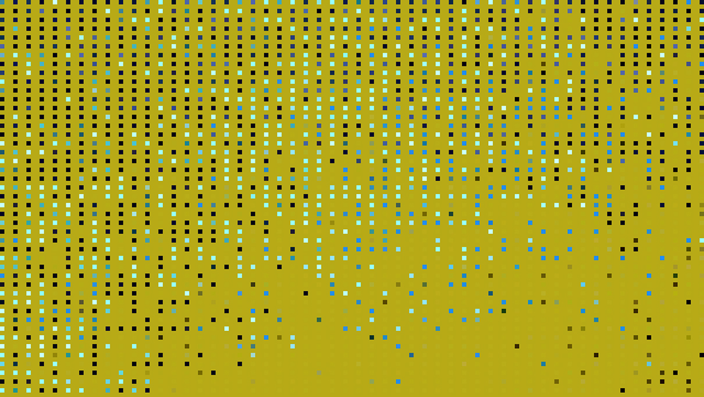

# Major-project

## 1.Work Description
This work does not require mouse or keyboard interaction. After opening the webpage, wait for a few seconds, and the animation effect will automatically start and loop

## 2.Details of individual approach

### Method
I use Perlin noise and random values or seeds to drive animations

### Animation and differentiation
I choose to divide the entire shape into rectangles of the same size, and then let these rectangles move freely. After a period of time, these rectangles return to their original positions
The effect of my team member's code is that small squares move in an orderly manner and gradually disappear, and another effect is to use a mouse to control and change the position, color, and size of graphics

### Source of inspiration
My inspiration comes from the following works

[Link-01](https://reas.com/youtube/)

[Link-02](https://reas.com/century_xxx/)

